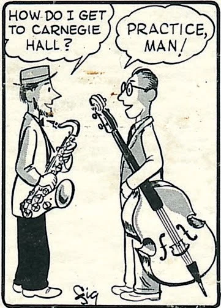
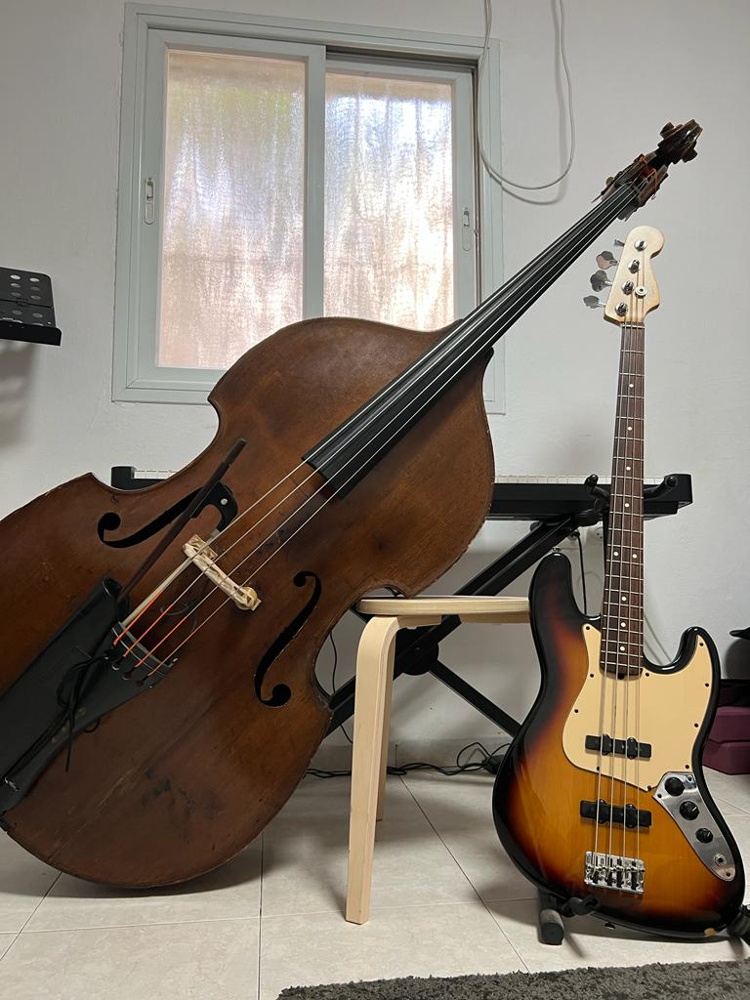
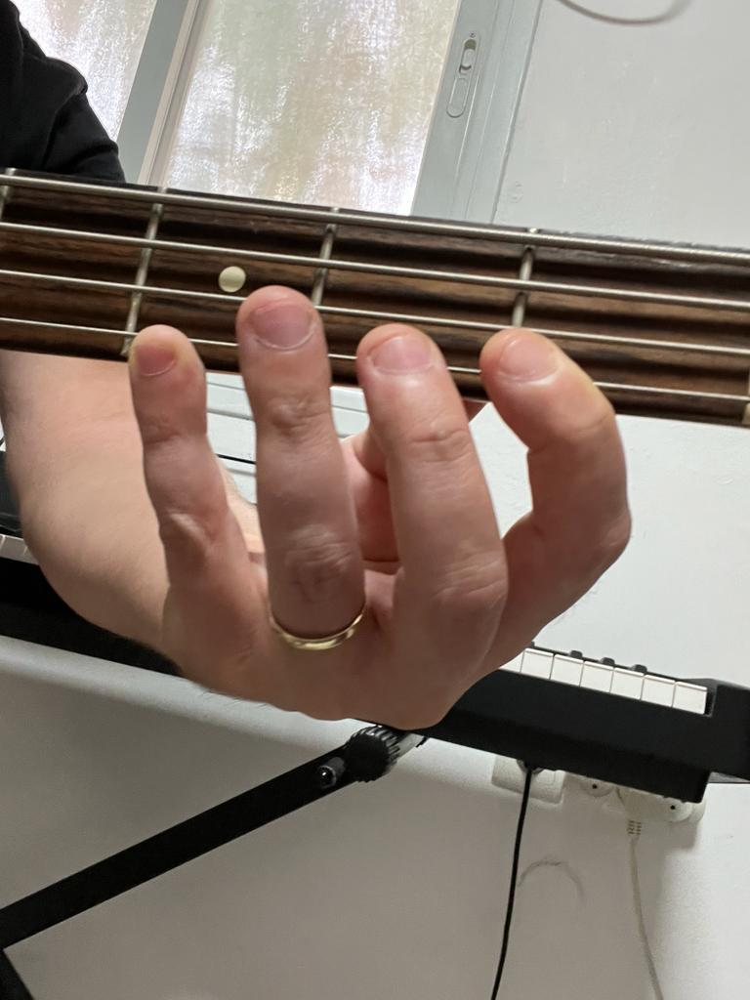
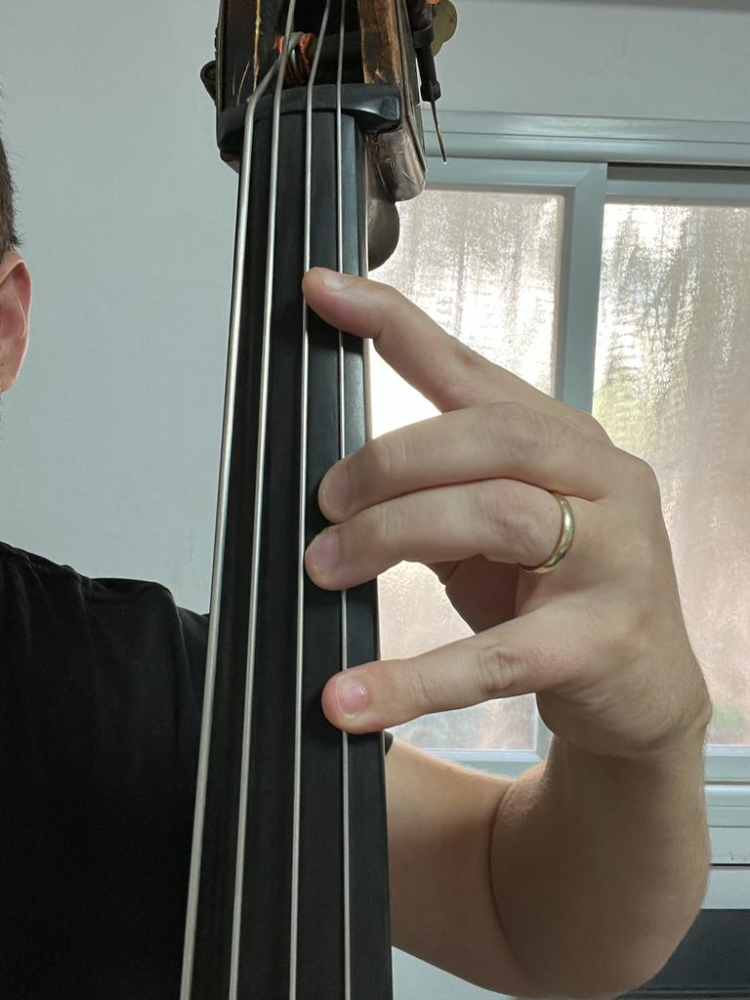

# Project Name

Few Introduction words

The funny gif above describe in a very percise way on of the biggest concepts of being a musician - practice makes prefection.
As a double player, practice is a main part of my day. 

For a long time i have been thinking how my knlowadge in coding and data analysis, could help me practice better. practicing every day has a potential of creating a very large amount of data, that when can use in many different ways.

This project was born from my passion to both music and data analysis, and the desire to constatnly improve in these fields. I have created a tool that analyses my prectice perforamnce, and yields useful information of how good did i practice. 

## The Chalange 

### Differences Between Electric and Double Bass

As an electric bass player for many years, playing a double bass seems like the "natural" next step. Altough similar, there are many differences between the instruments - size, playing techniques, and many more.

One of the main chalanges that exist in double bass but not i an electric bass, is the fact that double bass is fretless, meaning it has no frets. 
Frets are metal "stripes" attached to the elctric bass (or any other guitar). When positioning the finger behind some fret, a single note can be played in a percise way, since the fret location is constant. In double bass (or any other string, of fretless instrument), frest do not exist, so positioning the finger can procuce any tone, which can be not percise, if the finger position is not exactly accurate. In this situation, the double bass player should always listen to the played notes, and determine if they are accurate, high, or low, comapred to the desired note. I "Data Terms" the electric bass has "discrete" data, and the double bass has "continous" data.

The following figures show the difference between and electric and double bass.

the fingers are positiones behind the fret, so the same note is procued

the double bass is fretless, and no marlings, so one must hear to produced sound and determine if it is accurate.

### The Goal of This Project

Unlike the electric bass, playing well double bass requires the ability of hearing very perciecly, which is a very chalanging and time consuming task, that makes a lot of practice and effort.
This project was born from my will to create a tool to help me with thhis problem. This tool should:
1. Get an audio file of me playing some musical phrase with the double bass
2. Analyze the audio recording
3. Producing and analysis and score of my performance in terms of "how accurate was i in my playing in terms of pitch"
4. Comparing my corrent performance to older preformances of the same musical phrase

## The Data

### What is sound

#### Time Domain
The perception of sound is related to the detection of changes in air pressure in time by our ears, and the translations of these changes into sound perception by owr brain.  Periodic changes in air pressure (the same changes in air pressure pattern repeats it self for certain, constant period of time) cause the perception of a different tones. Let's use an example:

The following graph shows a pure sine signal. the x axis is time, and the y axis is the air pressure (arbitraty units)

[image of signal]

#### Frequency Domain

If we could determine what is the frequency of the signal, we could determine what tone it represents. Luckily, we have a tool just for that, called the Fourier transform, that can change the representation of the signal from time domain to frequency domain (and vise versa). The following graph shows the result of applying a fourier transform on the signal:

[image of fourier transform on the signal]

The x axis shows different frequency values and the y axis shows the amplitude of each frequency. Note that here, we get a very high peak at 440 Hz, meaning that we found out that the frequency of the signal is 440 Hz.

#### Pitch

pitch is the perception of a musical tone as high or low. For example, a female singer sounds "higher" than a male singer. A single musical tone can be described by different pitch values. The following figure shows the piano keyboard with the different notes, each represents a single "pitch".

[piano image]

Each single note is represented with a single frequency. previously we showed that the frequency of the signal is 440 hz. If we would make a speaker membrane vibrate by that frequency (440 vibrations in second) we would percieve that as the note A2. So each note is directly represented by a single "main" of "fundemental" frequency. The following graph shows this connection, where x axis is different frequency values and y the fitting notes:

[frequency-note graph]

Note that there are many more different attributes. The signales in the real woeld data are note purely periodic, and composed from multiple combinations of sine waves, where a single sine is the most dominant at determines the fundemental frequency. We also have timbre which is the "color" of the sound rather than pitch, power which determines how loud the sound is (determines by the amplitue, which represents the amount of air molcules that move)

pitch accuracy is basicaly playing the right note, ot the right fundemental frequency.

#### Musical Note

in it's mose "dry" wat, music is simply a combinations of different notes that change in time. There are many ways to represent music, but the mose used way is the western ...; Here is an example of notes:

[notes image]

the important part here is that each note has:
1. pitch - represented bt the height of the note in the bar
2. duration - how much time the note should be played, represented by the "leg" of the note.

### Data Flow

The goal of this project is to create a system that takes raw audio a signal and produces a report about the manner of playing in terms of pitch accuracy. This information can not be achieved directly from raw audio, so some data processing should be preformed. Let's determine what are the known parameters and what are the different stages in data processing.

#### Known Parameters

1. BPM - the BPM is known and would not be estimated from the estimated music. All recrodings should be preformed with a metronome.
2. What notes are played - each recording should contain known musical notes. The system won't estimate which notes would be played. Instead of score estimation, we would estimate the frequency of the played notes and comapre them to the known frequency of the labels.

After reviwing the basic terms, let's describe the data flow. First, 

#### Data Flow
1. Recording a muscial phrase with metronome.
2. creating a file of labels of the musical piece that was played that would contain the BPM and each note's pitch and duration.
3. Signal Framing
4. Transforming the signal from time domain to frequency domain
5. Estimating the Fundemental Frequency of each frame
6. Aligning the signal with the labels
7. Comparing each notes recoreded frequency with the "target" frequency, and claculating each note's error
8. claculating statics, performance "score" and producing different graphs that describe the data

## The Code

put areference to jupyter notebook:
1. how to use the code
2. describe the different parts in the code 

## Example File

choose an example file to show the process
1. show how the file was recorded (Video / Audio)
2. show the command used to run the code in order to process the file
3. show the results
4. discuss the results

## Limitations

1. run the code for "perfect" data, and show that the model has some bias 
2. discuss about model limitations - mainly the labels

## About Me

1. Few words about myself
2. My Data Science / Academic background
3. My musical background
4. Contact information